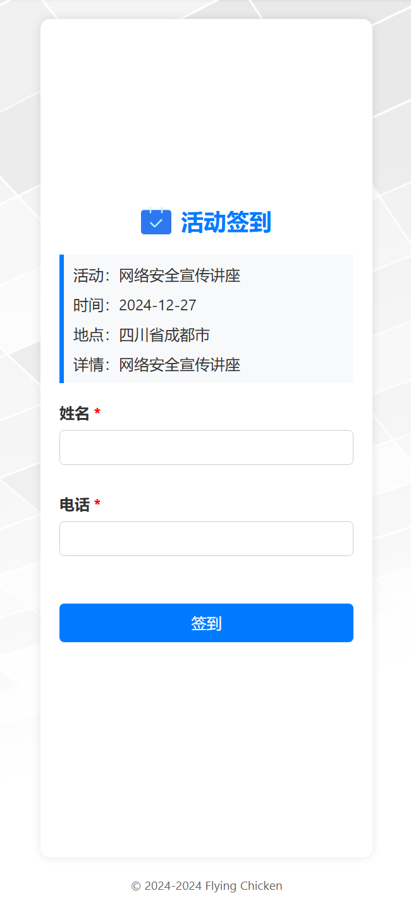
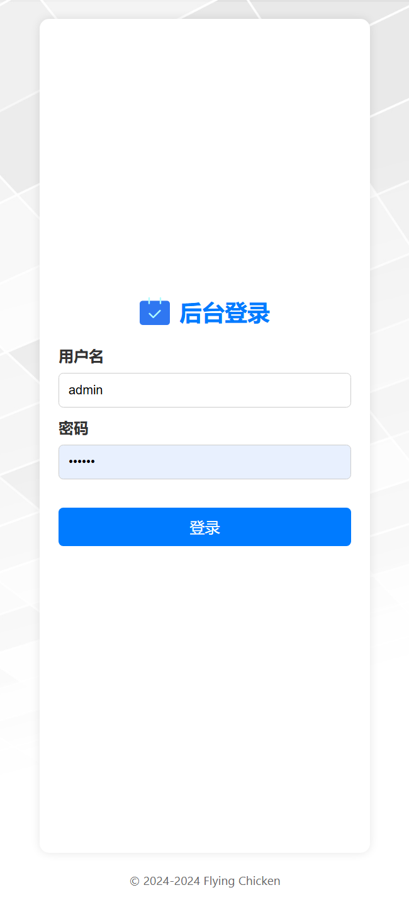
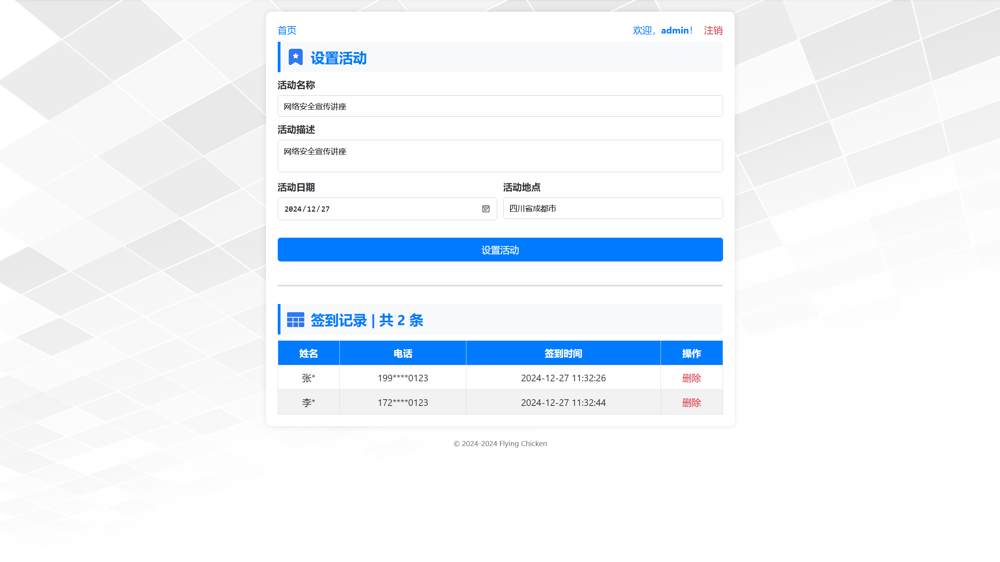

# Flying Chicken

一个简单的签到 Web 应用，基于 Flask 框架，使用 SQLite 数据库。

## 部署

建议在 Linux 系统下使用 Docke 部署。

```bash
git clone https://github.com/GitZhiQing/FlyingChicken.git
cd FlyingChicken
# 设置 docker-compose.yml 中的环境变量
# - SECRET_KEY
# - ADMIN_NAME
# - ADMIN_PASSWORD
docker-compose up -d
```

> [!WARNING]
> 本项目仅适用于学习和测试，请勿在生产环境中使用本项目。

## 效果

<div style="display: flex; justify-content: space-between;">
  
  
</div>
<br>


